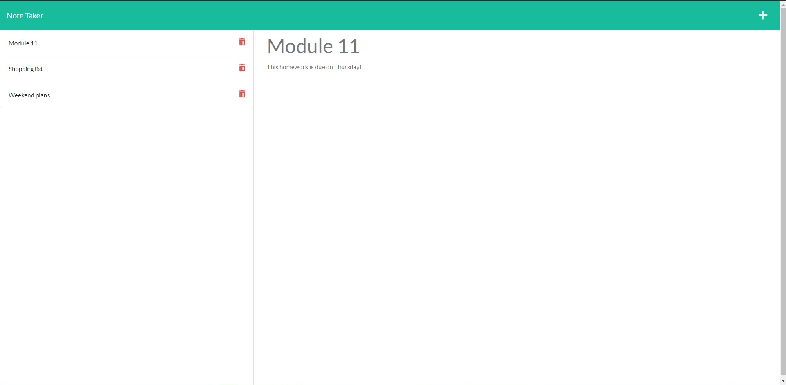

# Express Note-Taker

## Table of Contents
* [Description](#description)
* [Installation](#installation)
* [Screenshot](#screenshot)
* [Video](#video)
* [Usage](#usage)
* [Licenses](#license)
* [Questions](#questions)
* [Credits](#credits)

## Description
- Using express.js this app creates a note taker that allows you to write and save
your notes to a local server.

## Installation
- Node.js
- npm start

## Screenshot

## Video

## Usage
To take notes and keep track of events

## Licenses
This project is covered under the MIT license. click the license button at the top to learn more.

https://opensource.org/licenses/MIT

## Questions
Questions regarding this project?
GitHub: https://github.com/Ryebread5555
Email: rypetty55@gmail.com

## Credits
- NodeJS
- Express.js
- Bootstrap